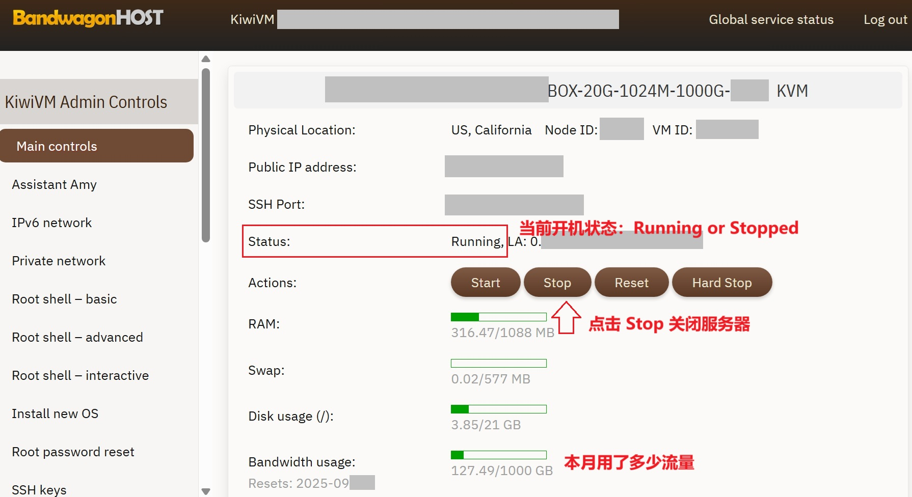
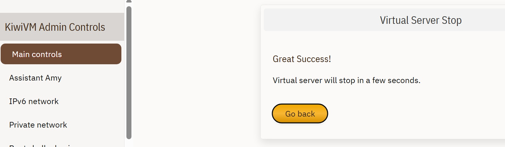
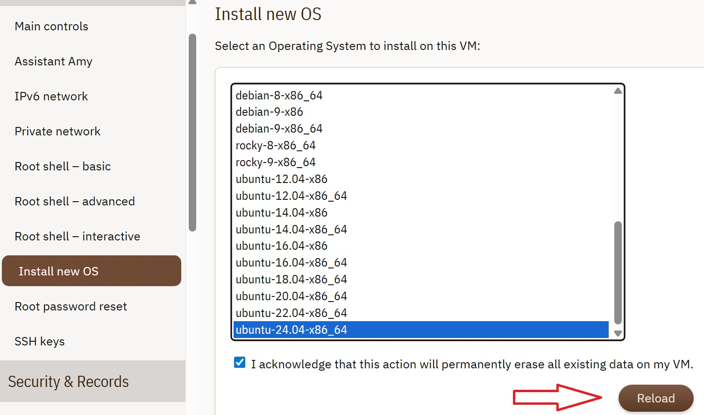
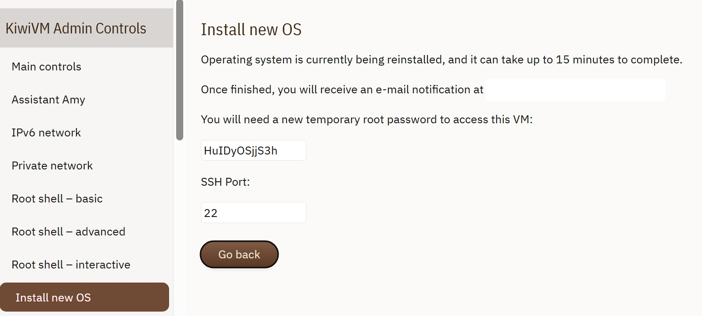
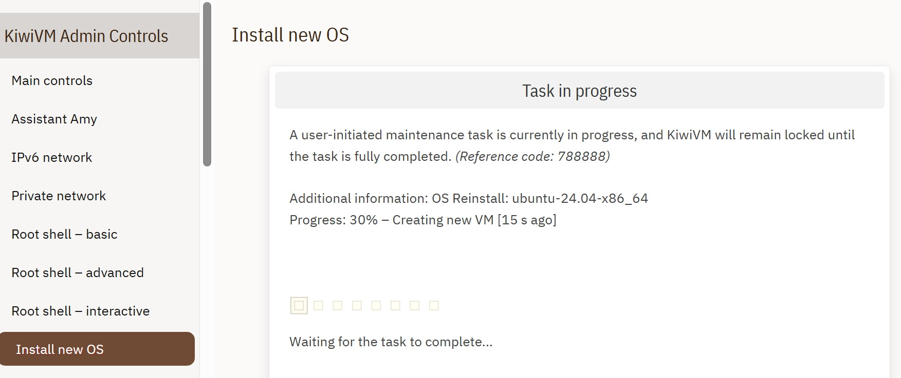
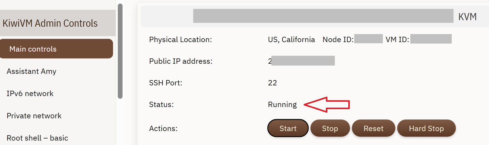
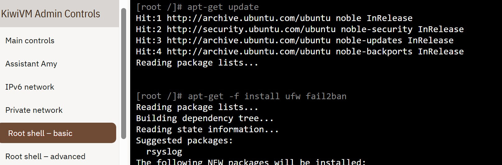
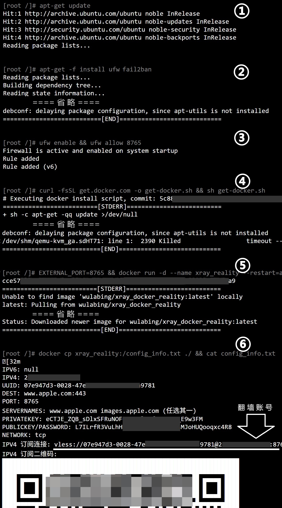

+++
title = "如何自建梯子翻墙（新手友好版）"
date = "2026-03-08"
tags = [
    "GFW","docker","reality","vless"
]
[params]
  no_toc = false
  no_date = true
+++

## 介绍. 如何简单地自建梯子翻墙的教程

这是一篇教程，面向非技术人士，讲述如何用最简单的流程，自行购买海外服务器，自建梯子翻墙。

> 注意，中国区的苹果手机用户，请先参见本文第 4 部分的翻墙工具。如果你没有海外的苹果账号，很可能无法用本文的方法翻墙！
> 以及，本文提到的，购买 VPS 的网站、下载翻墙工具、以及这篇文章本身，可能需要你先能翻墙。

和寻找购买翻墙账号（所谓「机场」）相比，最隐蔽、最安全、也最划算的翻墙方式，从来都是自建梯子。

- 首先是安全性，很多大家能在国内买到的机场，本身就带有官方色彩，你通过这些机场上网，上网可能仍然受到监控；
- 如果机场运营方被抓，你和机场的交易付费，可能被追踪甚至追究；
- 购买的机场，因为用的人多，更容易被国家防火墙（GFW）识别而被封禁；自己建的梯子，如果只给自己和几个亲友用，反而不容易被盯上；
- 机场也可能中断服务跑路……总之，如何寻找安全而靠谱的机场，本身也是一个难题；
- 自建的梯子更划算。以搬瓦工服务器为例，无折扣的情况下，每年 $49.99 美金，折合每月人民币￥30。每个月的流量限额为 1TB，可以和几个私密亲友同时使用，不限设备数量。这个性价比，应该远远超过购买的机场。

在这里，我们试着提供一篇攻略，希望能尽量简单，让非技术人士只需要逐行复制几个指令，就能自己动手建一个梯子。

- 这不是一篇教你如何运营机场的攻略。它没有为每个人建不同的账户、监控他们的流量、乃至计费；仅仅是用最简单的方式，生成一个翻墙账号。这个账号可以在很多个设备上一起用，也可以分享给你信任的亲友（如果每月 1TB 还会因为超出用量而争执，那就算了……），但无论如何，不要把账号流传给外人。
- 这也不是一篇，如何更好使用自建服务器（VPS）的攻略。本站的其它文章，致力于向大家介绍，如何在自己的海外服务器（VPS）上，使用各种便捷的工具：网盘、笔记、博客、密码管理、私密聊天、社群讨论……但这些存在更高的技术门槛。这篇攻略里，关于服务器的设置，做了很多简化，它的安全性和扩展性并不完美，但对于一架梯子来说，足够了。

这篇攻略包括以下步骤：

1. 购买海外服务器（VPS）；
2. 初始化服务器，进入命令行界面（ssh、或者服务商自带的界面）；
3. 在服务器安装翻墙服务，获得翻墙账号；
4. 在自己的电脑和手机上使用翻墙账号。

---

## 1. 购买海外服务器

首先，买哪一家的服务器，需要考虑的因素。如果只是用来建翻墙梯子，只需要考虑四点：

1. 海外服务器在国内的访问速度；
2. 每月的流量限额；
3. 价格；
4. 你买到的服务器的 ip 地址，会不会已经被国内封了？

如果你还计划用这台服务器做其它事情（譬如练习建个网站），还需要考虑更多：CPU、内存、硬盘……但如果只是梯子的话，上面四点足够了。事实上，很多专门用来做梯子的服务器，同样价格下，也会更偏向提供更多速度和流量，机器本身性能不高，也做不了太多额外的事情。

网上有很多各家服务器的对比，这里就无脑**推荐 bandwagonhost.com** （搬瓦工）了。当然，访问这个网站本身，也是要先翻墙的。

搬瓦工的付费方式，包括信用卡、支付宝、银联、微信……用国内的支付方式当然不安全；不过，在当今的监管力度下，如果不涉及运营机场，只是付款买个服务器，应该还不至于被找麻烦。

搬瓦工最基本的[服务器产品](https://bandwagonhost.com/order/basic/Los%20Angeles/USCA_2)，个人用足够了：

- 年费 $49.99
- 每月 1TB 流量
- 1G 网速，国内实测下载 18MB/秒、上传 6MB/秒，当然，多人同时使用会变慢
- 内存 1GB，磁盘 20GB。运行系统和安装梯子，会占用不到 300MB 内存，8GB 磁盘。

更高一档的[服务器，年费 $169.99 或季付 $49.99](https://bandwagonhost.com/order/ecommerce/Los%20Angeles/USCA_9)，同样每月 1TB 流量，机器性能也不变；但速度更快，可以在全球 12 个机房切换。不差钱的用户可以考虑。但是**建议不要买机房在香港的服务器**，虽然香港的网速可能更快一点，但要记住，香港也是不能用 ChatGPT 的……

另外，关于搬瓦工的优惠码和邀请码：

>上网搜 搬瓦工优惠码，在付款时输入，有大概 6% 的优惠；
>
>邀请其它人注册购买搬瓦工，可以获得你的下线付款的 22% 的提成，还是很多的！**本站的邀请码**链接为：[https://bandwagonhost.com/aff.php?aff=80635](https://bandwagonhost.com/aff.php?aff=80635)  欢迎大家通过我们的链接注册搬瓦工。本站获得的提成收入，将全部用于为国内需要翻墙的社群提供援助。读者注册后，也可以在 [Affiliate 页面](https://bandwagonhost.com/affiliates.php)开通提成功能，再去邀请其他人，但要注意身份保密。

具体购买的过程，大家应该自己看英文界面，就能搞定吧？

1. 进入网站 https://bandwagonhost.com/ （需要翻墙）；
2. 选择[最初级的产品（Basic VPS）](https://bandwagonhost.com/order/basic)，然后选择机房和数据中心，选哪一个都差别不大（不要选香港），[洛杉矶这个](https://bandwagonhost.com/order/basic/Los%20Angeles/USCA_2)用的大公司多，口碑好一点；
3. 选第一行年费 $49.99 的方案，加入购物车；
4. 在购物车里可以输入优惠码 Promotional Code，验证优惠码后，进入 Checkout；
5. 填写注册信息，需要一个有效的电子邮件地址，其它姓名住址，乱填也可以；
6. 选择付款方案，付费。

[这个网站](https://www.bandwagonhost.net)有更详细到每一步的[中文购买教程](https://www.bandwagonhost.net/716.html)，大家可以参考一下。当然，网站里的链接都是带着它家的提成代码的。

---

## 2. 初始化服务器

### 进入搬瓦工自带的命令行界面

这时，你已经完成了搬瓦工（或者其它家服务器）的注册与购买。在搬瓦工页面的右上方，进入 Client Area。

在网页菜单中，选择 Services - My Services，可以看到你购买的服务器。点击 Manage 下方的齿轮图标，Open KiwiVM，进入服务器的设置页面。

在 KiwiVM 界面的 Main controls 中，可以看到你购买服务器的使用信息，以后可以随时登录到这里，查看你使用了多少流量

- ip 地址
- 启动、停止 服务器的按钮
- 内存（RAM）和硬盘（Disk usage）的使用量
- 本月已使用多少流量（Bandwidth usage）



然后，重装系统。

### 重装系统

首先在 Main controls 里，点击 Stop，把正在运行的服务器停止。



点击左边的 Install new OS，给服务器安装操作系统。在右侧页面列出来的操作系统里，选择最下方的 Ubuntu-24.04，勾选确认框后，点击 Reload。



下一步的页面里，显示正在重装系统，同时，会生成一个根用户的密码（root password），把这个密码记录下来。——如果只是按照本站教程，在搬瓦工的网页里自建梯子，应该是用不到这个密码的；但如果你有更高级的需求，需要自行远程登录 VPS 服务器，这个密码是必须的。



在上面的页面，点击 Go Back 后，会显示安装进度，几分钟后安装完毕。



安装完毕后，进入 Main control，查看系统是否处于 Running 状态。



点击左边栏的 Root shell - Basic，看到右边黑色屏幕中的命令行提示符 

```
[root 	/]#
```

就可以进入下一阶段，复制命令，安装梯子软件。



---

## 3. 安装翻墙软件

本文介绍的翻墙软件，使用 Reality 翻墙技术，和之前的翻墙技术相比，更加隐蔽，省略了自己购买、验证域名的步骤。关键的程序，采用了 [wulabing 制作](https://github.com/wulabing/xray_docker/tree/master/reality)的 Docker 程序包，让安装过程更为简单。

一共有 6 行命令，在 root # 提示符后面，复制下面的命令，然后按回车键执行。直到提示符再次出现，复制运行下一条命令。6 行命令的运行效果大致如图：



1. 更新系统软件

```
apt-get update
```

2. 安装系统防火墙

```
apt-get -f install ufw fail2ban
```

3. 启动、配置防火墙。

	- 这里的 8765，可以自行改成 2000 ~ 9000 之间的任意数字，但需要和命令 5 里的 8765 保持一致。

```
ufw enable && ufw allow 8765
```

4. 安装 Docker，一个可以简化安装过程的工具

```
curl -fsSL get.docker.com -o get-docker.sh && sh get-docker.sh
```

5. 安装梯子程序

	- 就像命令 3 说的，可以把 8765 改成任何数字，但要保持一致。

```
EXTERNAL_PORT=8765 && docker run -d --name xray_reality --restart=always --log-opt max-size=100m --log-opt max-file=3 -p $EXTERNAL_PORT:443 -e EXTERNAL_PORT=$EXTERNAL_PORT wulabing/xray_docker_reality:latest
```

6. 获得翻墙账号
```
docker cp xray_reality:/config_info.txt ./ && cat config_info.txt
```

安装完成！！

最终的账号，长相是这个样子的
```
vless://07e947d3-0028-47e5-a761-c706203a9781@123.123.123.123:8765?encryption=none&security=reality&type=tcp&sni=www.apple.com&fp=chrome&pbk=L7ILrfR3VuLhHIn6CjCMlWrfTj9JsMJoHUQooqxc4R8&flow=xtls-rprx-vision#123.123.123.123-wulabing_docker_vless_reality_vision
```


## 4. 如何在电脑和手机上使用翻墙账号

并不是所有常见翻墙软件，都支持本文生成的翻墙账号（譬如著名的 SSR 小火箭，就还没有支持最新的 vless reality 协议）。本文只是简单地列出了，各个平台的一些可用的工具；并不能列举所有。

本文也并没有为每个软件，写出手把手的截屏教程，工作量太大。所以目前只是粗略地介绍一下，以后视需求进行补充。大家可以自行搜索相应的软件的使用教程。

### android 安卓手机

- 推荐用 [v2rayNG](https://github.com/2dust/v2rayng)，从 github [直接下载 apk](https://github.com/2dust/v2rayNG/releases) 安装，默认下载 [universal 版本](https://github.com/2dust/v2rayNG/releases/download/2.0.15/v2rayNG_2.0.15_universal.apk)就可以。

### ios 苹果手机

对于国内用户而言，苹果手机的翻墙，是最麻烦的。

- 如果你只有国区的苹果账号，那么，应该没有任何已知的方法，可以为苹果手机安装，支持自建翻墙账号的软件。苹果商店里搜到的翻墙软件，都是软件商本身在卖机场的，就像本文开头说的，安全性和稳定性都存在问题。
- 所以，苹果手机唯一的方法，大概是先去弄个海外的苹果账号，就可以在苹果商店下载这些翻墙程序：
	- v2box，[官网？教程](https://v2rayn.org/)，[下载地址](https://apps.apple.com/en/app/v2box-v2ray-client/id6446814690)。有广告，据说休眠时也会掉电量，但翻墙功能本身，似乎比其它软件更好用一些。
	- v2RayTun，[官网](https://v2raytun.com/)，[下载地址](https://apps.apple.com/en/app/v2box-v2ray-client/id6446814690)。

### windows 电脑

-  v2rayN（[官网](https://v2rayn.2dust.link/)，[github](https://github.com/2dust/v2rayn)），支持 Windows、Linux、MacOS，可从 github [直接下载 apk](https://github.com/2dust/v2rayN/releases) 安装包，具体哪个平台下载哪个安装包，可以参见[官网的说明](https://github.com/2dust/v2rayN/wiki/Release-files-introduction)。Windows 通常下载 v2rayN-windows-64.zip 即可。具体使用教程可以[参见这篇文章](https://v2rayn.org/)中的 "剪贴板导入教程" 部分，复制上面生成的 vless:// 地址，在软件中从剪切板导入。

### macos 苹果电脑

如果你使用的是 ARM 架构（Apple silicon）的 Mac 电脑，那么理论上来讲，任何手机上的 iOS 程序，也都可以在电脑使用。同时，也有专门为电脑设计的客户端：

- 刚刚提过的 v2rayN（[官网](https://v2rayn.2dust.link/)，[github](https://github.com/2dust/v2rayn)），支持 Windows、Linux、MacOS，可从 github [直接下载 apk](https://github.com/2dust/v2rayN/releases) 安装包，具体哪个平台下载哪个安装包，可以参见[官网的说明](https://github.com/2dust/v2rayN/wiki/Release-files-introduction)。具体使用教程可以[参见这篇文章](https://v2rayn.org/)中的 "剪贴板导入教程" 部分，复制上面生成的 vless:// 地址，在软件中从剪切板导入。

## 备注

1. 这篇教程面向单纯购买 VPS 只是为了翻墙的用户，对 Linux / Docker 有经验的用户，可以根据自己需要更改（关键只是第 5 条命令而已），可以改成更舒适的 docker compose，也可以参考 [wulabing 的 Dockerfile 文件](https://github.com/wulabing/xray_docker/blob/master/reality/Dockerfile)，自行编译更安全的版本。
2. 可以在一台 VPS 上，同时运行多个翻墙程序（同时运行不超过 5 个，还是没问题的），每个翻墙程序有各自的端口和账号，以便和不同的人分享。需要创建多个程序的步骤：

```
# 1. 选择一个新的端口号，譬如 8766，配置防火墙
ufw allow 8766

# 2. 类似命令 5，修改端口号、和 --name 后面的容器名称 xray_reality_2
EXTERNAL_PORT=8766 && docker run -d --name xray_reality_2 --restart=always --log-opt max-size=100m --log-opt max-file=3 -p $EXTERNAL_PORT:443 -e EXTERNAL_PORT=$EXTERNAL_PORT wulabing/xray_docker_reality:latest

# 3. 类似命令 6，使用新的容器名称，获得新的翻墙账号
docker cp xray_reality_2:/config_info.txt ./ && cat config_info.txt
```

3. 如果需要停止其中任何一个翻墙程序，只需要根据相应的容器名称，运行：

```
docker stop xray_reality_2
```

---

祝大家翻墙愉快。
