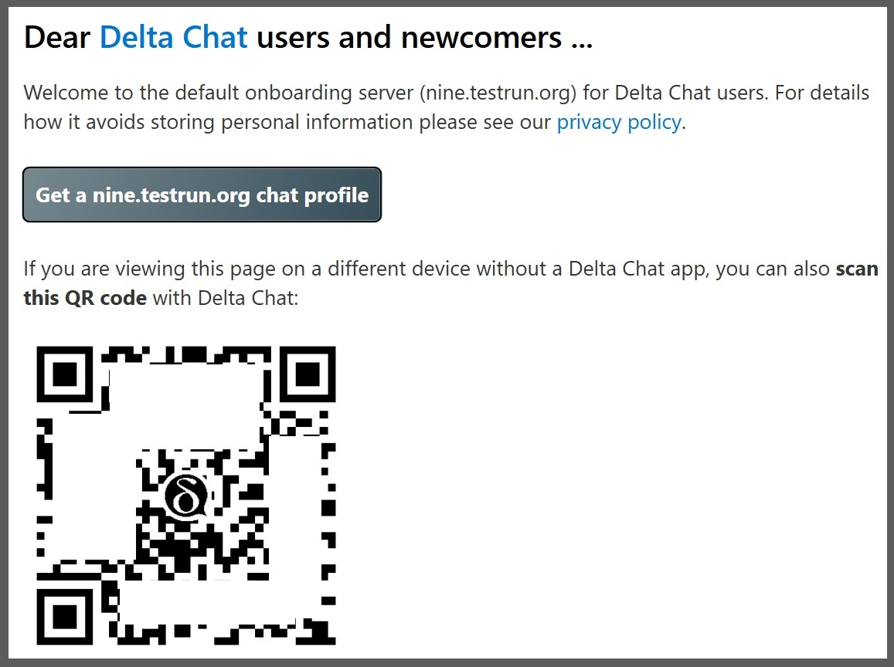
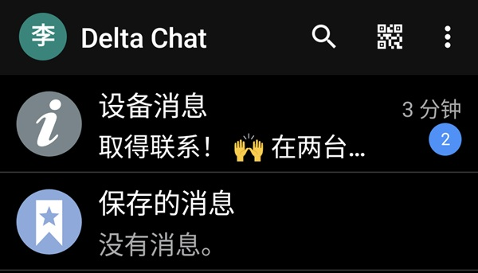
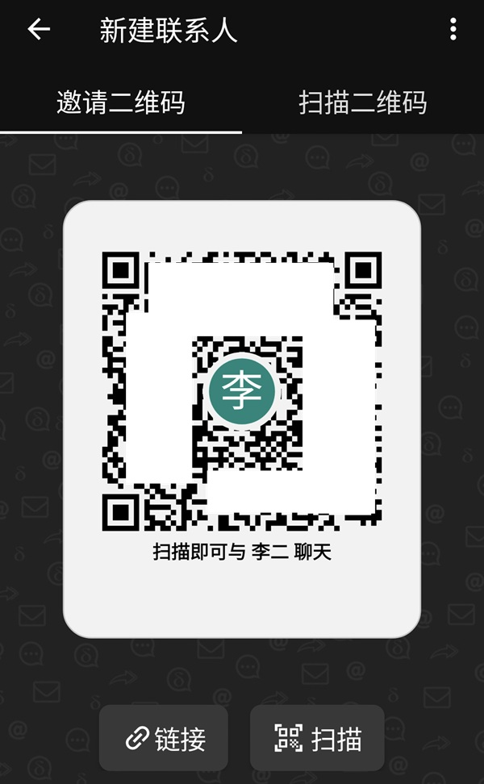

+++
title = "DeltaChat 使用介绍"
date = "2026-08-18"
tags = [
    "msg","GFW"
]
[params]
  no_toc = false
  no_date = true
+++

本文只是 DeltaChat 聊天软件的介绍、和简单的安装使用。如何自建中继服务器，将会在之后陆续介绍（还没写）。

## 1. DeltaChat 介绍

DeltaChat 是一个聊天软件，类似微信，但聊天信息是被加密的，不会被服务器运行商看到，更不存在审查，适合发送更加私密的消息。大多数这样的安全聊天软件，如今都需要翻墙才能使用，而 DeltaChat 通过去中心化的方式，（至少在目前）还可以免翻墙使用，为翻墙不便或者有顾虑的用户，提供了便利。

DeltaChat 相对于其它聊天软件的优点：

- 端到端加密，其他人（包括运营商）无法看到聊天内容，不会被审查监控；
- 注册时不需要手机号码或电子邮箱；
- 可以通过更换中继服务器（relay）的方式，不需翻墙也可以使用；
- 更换中继服务器时，不需要重新注册账号，可以保持原来的联系人和信息；
- 不需要手机，也可以直接在电脑上安装使用；
- 同一台设备，可以同时使用多个账号；
- 同一个账号，可以同时在多个设备上使用。

## 2. 安装

- 苹果手机 ios
	- 使用非中国区的账号，在苹果市场里搜索安装 DeltaChat
	- 如果只有中国区的苹果账号，无法安装。可改用其它手机或电脑版
- 苹果电脑 macos
	- 使用非中国区的账号，在苹果市场里搜索安装 DeltaChat
	- 从[官方网站](https://github.com/deltachat/deltachat-desktop/releases)下载 .dmg 安装程序（需翻墙）后，可以复制给墙内他人
- 安卓手机 android
	- 在 [Google Play](https://play.google.com/store/apps/details?id=chat.delta) 或 [F-Droid](https://f-droid.org/app/com.b44t.messenger) 市场，搜索安装 DeltaChat（需翻墙）
	- 从[官方网站](https://github.com/deltachat/deltachat-android/releases)下载 .apk 安装程序（需翻墙）后，可以复制给墙内他人
- Windows 电脑
	- 在[微软商店](https://apps.microsoft.com/detail/9pjtxx7hn3pk)搜索安装 DeltaChat（可能不翻墙也可以？）
	- 从[官方网站](https://github.com/deltachat/deltachat-desktop/releases)下载 .exe 程序（需翻墙）后，可以复制给墙内他人
- 更多平台（如 Linux）请参考[官方网站](https://delta.chat/en/download)和[官方 Github](https://github.com/deltachat/deltachat-desktop/releases)（需翻墙）

当前最新版本 v2.59.1 的官网安装包链接：

- 苹果电脑 .dmg 文件： https://github.com/deltachat/deltachat-desktop/releases/download/v2.59.1/DeltaChat-2.59.1-universal.dmg
- Windows 电脑 .exe 文件：
	- 安装版： https://github.com/deltachat/deltachat-desktop/releases/download/v2.59.1/DeltaChat-2.59.1-Setup.x64.exe
	- 便携版： https://github.com/deltachat/deltachat-desktop/releases/download/v2.59.1/DeltaChat-2.59.1-Portable.x64.exe
- 安卓手机 .apk 文件： https://github.com/deltachat/deltachat-android/releases/download/v2.59.1/deltachat-gplay-release-2.59.1.apk

DeltaChat 有多种语言的界面，但不能在程序里选择语言，只能和手机或电脑的默认语言一致。本文的攻略主要参照安卓手机上的 DeltaChat 的中文界面。其它设备应该大致相似。

## 3. 注册新账号

### 3.1. 选择哪个服务器？

注册新的 DeltaChat 用户，可以选择在[官网](https://nine.testrun.org/)注册，也可以在其它很多个不同的服务器上注册。无论你在哪个服务器注册的用户，都可以和任何其它服务器的用户，无障碍地添加好友、发送信息、群组讨论。

官方的服务器是 [nine.testrun.org](https://nine.testrun.org/)，已经被墙了，官网列出了一些[其它的](https://chatmail.at/relays)服务器，也都已经被墙了。除此之外，**有很多还没有被墙的服务器，可以让墙内的用户注册。为了安全起见，不在本文列出**，大家私下里传播。

如何判断服务器有没有被墙呢？只需要在不翻墙的情况下，在浏览器里输入服务器的网址，如果能正常打开，就说明这个服务器还没有被墙，在这个服务器上注册的账号，不需要翻墙就可以和其他人聊天。

### 3.2. 注册账号流程

以官方服务器为例，安装好 DeltaChat 程序后，在浏览器里输入服务器的网址 https://nine.testrun.org （这个网址已经被墙了，请换成其它服务器的网址），显示的内容如下图所示（通常不会是中文，而是英文或其它语言），包含一个按钮和一个二维码：

- 方法 1. 如果在安装了 DeltaChat 的手机或电脑上，使用浏览器，只需要点击按钮【Get a ... chat profile】，就会自动打开 DeltaChat 程序，根据提示输入你的名称，点击【同意并创建新账号】，用户就创建好了。
- 方法 2. 如果在另外一台电脑或手机上使用浏览器，可以用 DeltaChat 扫描二维码来创建新账号。打开 DeltaChat → 创建新账号 → 使用其他服务器 → 扫描邀请码，扫描浏览器上的二维码，根据提示输入你的名称，点击【同意并创建新账号】，用户就创建好了。
- 注意，注册时【输入您的名称】，并不是唯一的账号 id，只是显示的昵称，以后可以随意更改。账号 id 是系统自动生成的，无法更改。

## 4. 使用

官网有一些[汉化过的帮助文档](https://delta.chat/zh_CN/help)。这里介绍一些主要的功能。

### 4.1. 添加联系人

在软件界面中，点击右上方的二维码图标，或者右下方的【 + 号 - 新建联系人】，

- 可以看到自己账号的二维码，让别人通过扫描二维码来添加自己。
- 可以点击扫描二维码来添加别人。
- 也可以点击【链接】生成字符形式的邀请码，发送给别人。对方收到字符邀请码后，点击右上角【从剪贴板粘贴】，就可以添加。

### 4.2. 添加多个中继服务器

一个 DeltaChat 账号，可以同时登记在多个服务器名下，收到消息时，会自动选择从当前能够连接的服务器接受信息。

添加中继服务器的方式，和注册新用户类似。在浏览器打开新的中继服务器的网址，

- 方法 1. 如果在安装了 DeltaChat 的手机或电脑上，使用浏览器，点击按钮【Get a ... chat profile】，就会自动打开 DeltaChat 程序，为当前的 DeltaChat 用户添加中继服务器。
- 方法 2. 如果在另外一台电脑或手机上使用浏览器，可以用 DeltaChat 扫描二维码来创建新账号。打开 DeltaChat → 设置 → 高级 → 中继，点击右下角的【+】，扫描浏览器上的二维码，就可以添加新的中继服务器。

有多个中继服务器的情况下，接受信息时，程序会自动选择能连通的中继服务器，但发送信息时，需要手动指定从哪个中继发送，在【设置 - 高级 - 中继】里，点击每个中继服务器，可以切换当前从哪个中继服务器发送信息。其它暂时不用来发送信息的服务器，可以长按后删除。

建议添加 2~3 个可连通的中继服务器，以避免单个中继服务器突然被封禁，或者突然崩溃的情况。另外，在有能力翻墙的情况下，建议把官网服务器 https://nine.testrun.org 添加到中继服务器列表里，避免其它小型中继服务器崩溃而造成账号丢失的情况。

## 5. 其它重要功能

### 5.1. 重置你的二维码

在显示自己账号二维码的界面的右上角菜单，可以选择【重置二维码】。人们再也无法根据旧的二维码添加你的账号，但已经添加的联系人和聊天记录仍然存在。

### 5.2. 备份账号

DeltaChat 的账号密码是隐藏在设备内部的，并没有让用户可以输入的密码，也没有短信或邮件验证码。如果使用这个账号的所有手机或电脑全都不见了（譬如删除软件、手机重置、丢失），你不能在一无所有的情况下，重新进入原有的账号。除非提前进行过账号备份。

- 如果装有 DeltaChat 的手机需要重置，最好先在另一台设备上登录这个账号【设置 - 添加第二台设备】（需要在同一局域网内），重装后再登录回原先的手机。
- 可以把当前账号导出到一个文件。重新安装 DeltaChat 后，选择【我已有账号 - 从备份恢复】。注意：
	- 导出的文件，要及时转移到其它设备上，否则，如果手机重置，导出文件也会一起消失；
	- 导出的文件没有密码，保存时要注意保密，建议自建一个带密码的压缩文件保存；
	- 导出的文件包括导出时的所有联系人和聊天记录，但是，从导出到下次导入之间，别人发来的信息，可能无法收到。

### 5.3. 关于存储空间

因为 DeltaChat 并非商业软件，无法为每个用户分配无限大的存储空间。官方服务器的存储上限是 700MB，其它服务器可能只有 100MB。所以聊天还是以文字为主，要像在微信那样尽情传图片，可能很快就到了上限。

- 在【设置 - 连接】菜单，可以看到你在当前的中继服务器，占用了多少存储空间，和存储空间的上限。
- 所有媒体文件都可以（像微信那样）保存到本机，然后删除。
- 在右上角【所有媒体】菜单，可以查看收到的媒体文件，批量导出和删除。
- 可以为单个或者所有聊天窗口，设置多久之后自动销毁，但这样销毁的不只是媒体文件，文字记录也会删除。
